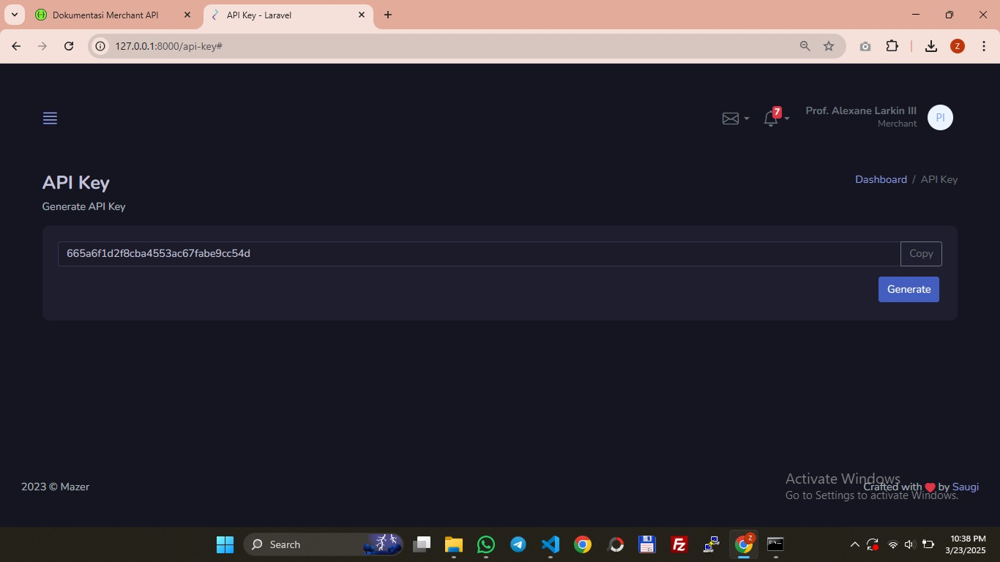

## Teknologi

- PHP 8.2.12
- Laravel 10.48.28
- MariaDB 10.4.32 
- Node.js 21.7.3
- Jetstream 4.3.1 (Livewire 3.5.20 + Tailwind CSS 3.1.0)
- Mazer 2.3.1 (Bootstrap 5.3.3)
- Spatie 6.15.0

## Generate API Key

## Dokumentasi API

## License

The Laravel framework is open-sourced software licensed under the [MIT license](https://opensource.org/licenses/MIT).

## Hubungi Kami

Kami MajuAppZ adalah usaha di bidang jasa pembuatan website. Silahkan kunjungi website resmi kami di [Majuappz.com](https://majuappz.com).